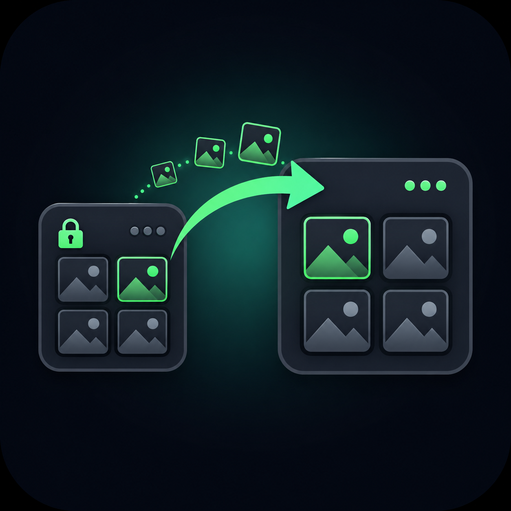
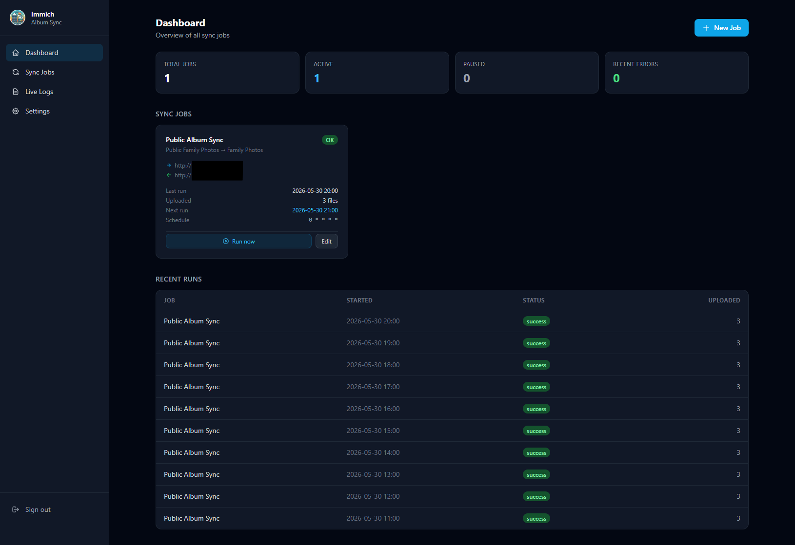
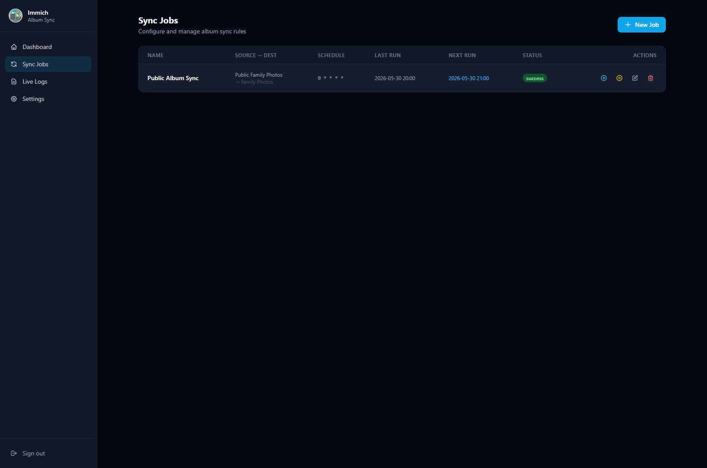
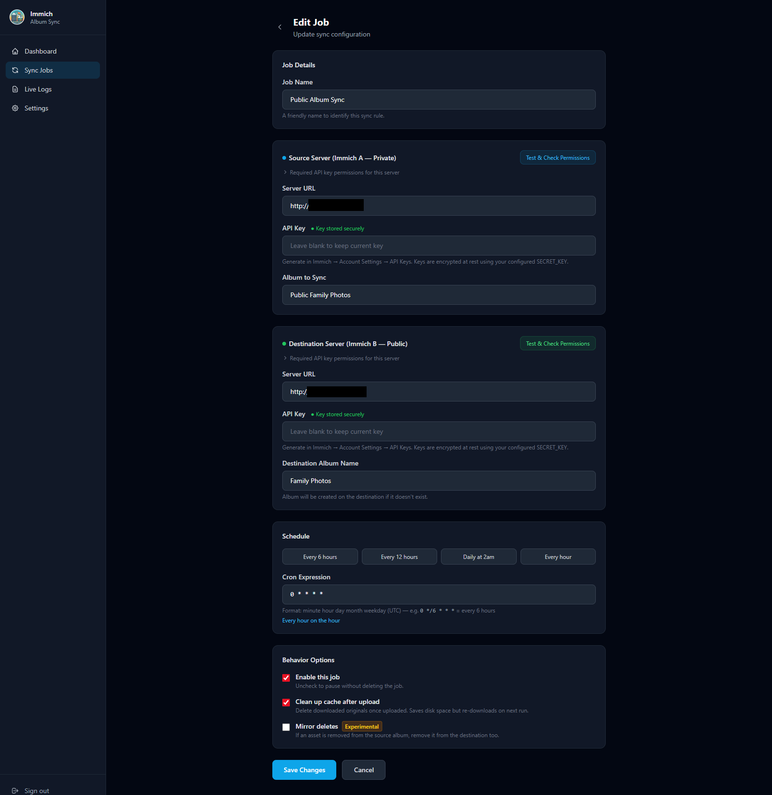
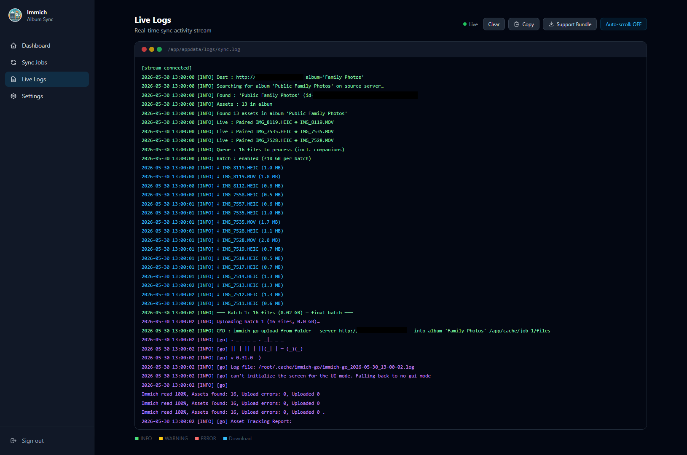
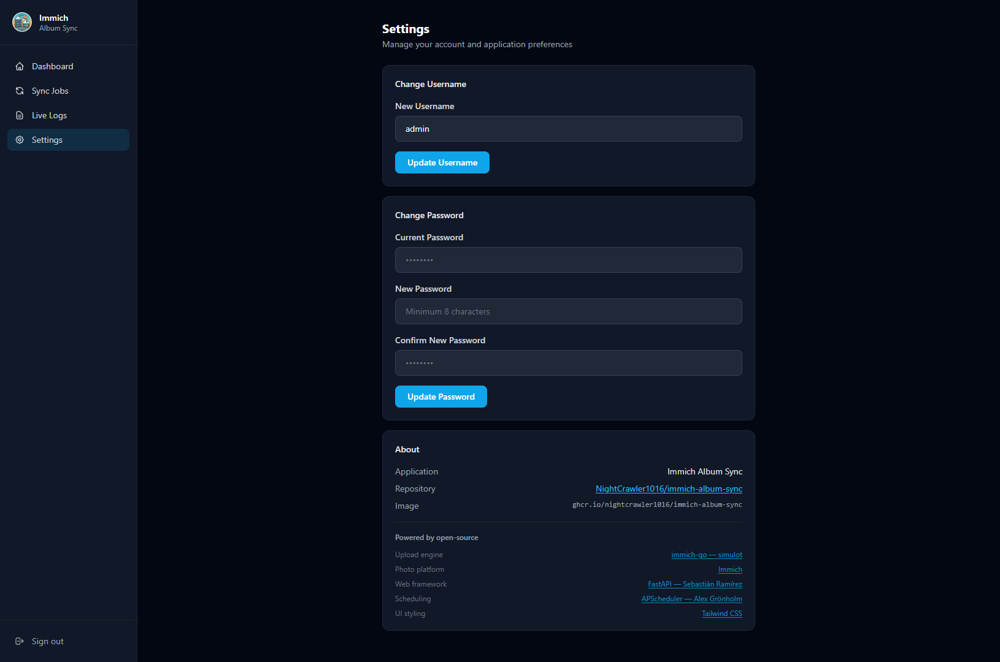

<div align="center">



<h1>Immich Album Sync</h1>

<p>
  <strong>One-way album sync between two <a href="https://immich.app">Immich</a> servers — with a web UI.</strong><br/>
  Built for Unraid, runs on any Docker host.
</p>

<p>
  
  
  
  
</p>

</div>

```
Immich A (private)  ──────────────▶  Immich B (public/family)
    Master library                       Curated albums only
```

## Features

- 🖥️ **Web UI** — configure sync jobs, view status, stream live logs from the browser
- 🔐 **Password-protected** — username/password login; forced password change on first login
- 🔑 **Encrypted API keys** — all API keys are AES-encrypted at rest; never stored or rendered in plaintext
- 📅 **Cron scheduling** — configurable per-job schedule, runs automatically in the background
- 📸 **Preserves originals** — downloads and uploads raw files with EXIF and GPS intact
- 🍎 **Live Photo support** — automatically pairs `.HEIC` + `.MOV` files
- 🔁 **Duplicate-safe** — uses `immich-go` for smart duplicate detection on the destination
- ⚡ **Incremental & bandwidth-friendly** — checks the destination by checksum before downloading, so re-syncing an unchanged album transfers almost nothing
- 📱 **Mobile-responsive** — works on phones, tablets, and desktops
- 🚀 **Multi-job** — sync multiple albums with different schedules and servers
- 🔍 **API permission checker** — test and verify required Immich API key permissions per job
- 📦 **Support bundle** — one-click download of logs, sanitized config, and run history for troubleshooting

---

## Screenshots

<div align="center">

<a href="screenshots/1-dashboard.png"></a>

<sub><b>Dashboard</b> — job overview, status tiles, and recent run history</sub>

</div>

<br/>

<details>
<summary>🔁 <b>Sync Jobs</b> — manage all album sync rules at a glance</summary>
<br/>
<div align="center">
  <a href="screenshots/2-sync-jobs.png"></a>
</div>
</details>

<details>
<summary>✏️ <b>Edit Job</b> — servers, API keys, schedule &amp; behavior</summary>
<br/>
<div align="center">
  <a href="screenshots/3-edit-sync-jobs.png"></a>
</div>
</details>

<details>
<summary>📜 <b>Live Logs</b> — real-time, color-coded sync activity stream</summary>
<br/>
<div align="center">
  <a href="screenshots/4-live-logs.png"></a>
</div>
</details>

<details>
<summary>⚙️ <b>Settings</b> — credentials, account, and app info</summary>
<br/>
<div align="center">
  <a href="screenshots/5-settings.png"></a>
</div>
</details>

---

## Quick Start (Unraid)

### Option A — Community Applications XML Template

1. In Unraid, go to **Apps → My Apps** (or add a template manually)
2. Use the XML template from this repository: `immich-album-sync.xml`
3. Set a unique `SECRET_KEY` (32–64 random characters — see [Security](#security))
4. Start the container and open `http://your-unraid-ip:8080`
5. Log in with `admin` / `admin` — you will be prompted to set a new password immediately

### Option B — Unraid Docker UI (manual)

| Setting | Value |
|---|---|
| Repository | `ghcr.io/nightcrawler1016/immich-album-sync:latest` |
| Name | `immich-album-sync` |
| Port | `8080` → `8080` |
| Path `/app/appdata` | `/mnt/user/appdata/immich-album-sync` |
| Variable `SECRET_KEY` | A 32–64 character random string (required) |
| Variable `TZ` | Your timezone (e.g. `America/New_York`) |

### Option C — docker-compose

```yaml
services:
  immich-album-sync:
    image: ghcr.io/nightcrawler1016/immich-album-sync:latest
    container_name: immich-album-sync
    restart: unless-stopped
    ports:
      - "8080:8080"
    volumes:
      - ./appdata:/app/appdata
    environment:
      SECRET_KEY: "replace-this-with-a-32-to-64-char-random-string"
      TZ: "America/New_York"
```

Then open `http://localhost:8080` and log in with `admin` / `admin`.

> **First-login password change is required.** You will be redirected automatically on first login.

---

## Security

### First-login Password Change

On first login with the default credentials (`admin` / `admin`), the application immediately redirects to a password-change screen. You **cannot access any other page** until a new password is set. The default password cannot be reused.

### API Key Encryption

All Immich API keys entered in sync job forms are encrypted before being stored in the SQLite database using **AES-128 (Fernet)** with a key derived from your `SECRET_KEY`. Keys are:

- Never stored in plaintext
- Never rendered in HTML (form fields always show empty; a "Key stored securely" indicator is shown instead)
- Decrypted only in memory at sync runtime

### SECRET_KEY Requirements

| Constraint | Value |
|---|---|
| Minimum length | 16 characters |
| **Recommended length** | **32–64 characters** |
| Maximum length | 128 characters (longer provides no additional benefit) |

Generate a strong key: [1Password Generator](https://1password.com/password-generator/) — select 32–64 characters with all character types.

> **Important:** Changing `SECRET_KEY` after the initial setup will **invalidate all stored API keys** (they were encrypted with the old key) and log out all active sessions. You will need to re-enter API keys for every sync job.

### Session Security

Sessions are signed with `SECRET_KEY` using `itsdangerous` and expire after 24 hours.

### Runs as Non-Root

The app process runs as an unprivileged user (`PUID:PGID`, default `99:100` = Unraid's `nobody:users`), **not root**. The container uses root only briefly at startup to fix data-directory ownership, then drops privileges. If your appdata is owned by a different user and you see permission errors, set `PUID`/`PGID` to match (see [Troubleshooting](#common-issues)).

### Brute-Force & CSRF Protection

- **Login rate limiting** — repeated failed logins from an IP are throttled (10 failures within 15 minutes triggers a 5-minute lockout).
- **CSRF protection** — state-changing requests are rejected unless their `Origin`/`Referer` matches the app's own host, on top of a `SameSite=Lax` session cookie.

### Safe Support Bundles

The downloadable support bundle never contains API keys, and server hostnames/IP addresses are masked in both `sync.log` and the job configs — so it is safe to share for troubleshooting.

---

## Environment Variables

| Variable | Required | Default | Description |
|---|---|---|---|
| `SECRET_KEY` | ✅ Yes | `change-me` | 32–64 char random string for session signing and API key encryption |
| `TZ` | No | `UTC` | Container timezone (e.g. `America/New_York`) |
| `PUID` | No | `99` | User ID the app runs as (non-root). `99` = Unraid `nobody` |
| `PGID` | No | `100` | Group ID the app runs as. `100` = Unraid `users` |
| `CLEANUP_CACHE` | No | `false` | Delete cached files after final upload (`true`/`false`) |
| `CACHE_PATH` | No | `/app/appdata/cache` | Download cache directory (see [Cache on external storage](#cache-on-external-storage-or-a-different-disk)) |
| `BATCH_SIZE_MB` | No | `10240` | Max MB to stage before uploading a batch (0 = unlimited) |
| `BATCH_FILE_COUNT` | No | `0` | Max files per batch (0 = unlimited, size limit still applies) |
| `DB_PATH` | No | `/app/appdata/config.db` | SQLite database path |
| `LOG_PATH` | No | `/app/appdata/logs/sync.log` | Sync log file path |

---

## Volume Mount

| Container path | Purpose |
|---|---|
| `/app/appdata` | All persistent data: database, cache, and logs |

Map this to a path on your Unraid array, e.g. `/mnt/user/appdata/immich-album-sync`.

### Cache on External Storage or a Different Disk

For large first-time syncs (hundreds of GB or multi-TB albums), you may want the download cache on a high-capacity array disk, a separate SSD pool, or a network share — rather than your primary Unraid cache pool.

**Unraid / Docker setup:**

1. Add a **second Path mapping** in the Docker template:
   - Container path: `/app/cache`
   - Host path: `/mnt/user/YourLargeDisk/immich-sync-cache` *(or any writable path)*
2. Set the `CACHE_PATH` environment variable to: `/app/cache`

The sync engine will write all downloaded originals to that path. The main `/app/appdata` volume (database, logs) is unaffected.

**docker-compose example with separate cache volume:**

```yaml
services:
  immich-album-sync:
    image: ghcr.io/nightcrawler1016/immich-album-sync:latest
    container_name: immich-album-sync
    restart: unless-stopped
    ports:
      - "8080:8080"
    volumes:
      - ./appdata:/app/appdata                     # database + logs (small, keep on fast drive)
      - /mnt/big-drive/sync-cache:/app/cache       # large cache on a different disk or share
    environment:
      SECRET_KEY: "replace-with-your-random-key"
      TZ: "America/New_York"
      CACHE_PATH: /app/cache
```

---

## Web UI Pages

| Page | URL | Description |
|---|---|---|
| Dashboard | `/` | Overview of all jobs, recent runs, and status |
| Sync Jobs | `/jobs` | List, create, edit, delete, and pause sync jobs |
| New Job | `/jobs/new` | Configure source server, destination server, album, and schedule |
| Live Logs | `/logs` | Real-time streaming sync log with copy and support bundle download |
| Settings | `/settings` | Change username and password |

---

## Setting Up a Sync Job

1. Open **Sync Jobs → New Job**
2. Enter the **Source Server** (your private Immich) URL and API key
3. Enter the **Destination Server** (your family/public Immich) URL and API key
4. Use the **Test Connection** button to verify API key permissions before saving
5. Select the source album name (populated from the test result)
6. Set a cron schedule (e.g. `0 23 * * *` for 11 PM daily)
7. Save — the job will run on schedule automatically

### Required API Key Permissions

| Server | Required Permissions |
|---|---|
| Source (Immich A) | `album.read`, `asset.read`, `asset.download` |
| Destination (Immich B) | **All permissions** (full-access key — see note below) |

> **Source note:** `asset.download` is a separate scope from `asset.read` — it is what actually permits downloading original files. A key with only `album.read` + `asset.read` passes metadata checks but fails every file download with `403 Forbidden`. `user.read` is **not** required on the source.

> **Destination note:** Uploads run through [immich-go](https://github.com/simulot/immich-go), which requires a broad set of scopes and validates the connection via `GET /api/users/me` (so `user.read` is mandatory here). Its documented requirements include `user.read`, `asset.read`, `asset.statistics`, `asset.update`, `asset.upload`, `asset.copy`, `asset.replace`, `asset.delete`, `asset.download`, `album.create`, `album.read`, `albumAsset.create`, `server.about`, `stack.create`, `tag.asset`, and `tag.create`. Because this set changes between immich-go versions, the simplest reliable choice is an **all-permissions API key** on the destination. A narrowly-scoped key fails with `Missing required permission: …`. For family sharing, create a dedicated non-admin user on the destination and use *their* all-permissions key.

See [Immich API Key documentation](https://docs.immich.app/features/command-line-interface/#obtain-the-api-key) for how to create keys with specific permissions.

---

## Batch Processing

The sync engine automatically processes large albums in rolling batches to prevent the local cache from filling up your disk.

### How batching works

Instead of downloading the entire album before uploading anything, the engine:

1. Downloads files until either `BATCH_SIZE_MB` or `BATCH_FILE_COUNT` is reached
2. Uploads that batch to the destination server
3. Clears the batch from the cache
4. Repeats until all files are processed

The **final batch** respects your `CLEANUP_CACHE` setting — intermediate batches are always cleared.

### Defaults

| Setting | Default | Meaning |
|---|---|---|
| `BATCH_SIZE_MB` | `10240` (10 GB) | Flush every 10 GB of downloaded data |
| `BATCH_FILE_COUNT` | `0` | No file-count limit (size limit still applies) |

With the default 10 GB limit, syncs under 10 GB behave exactly as before (single batch). Syncs over 10 GB are automatically split — you'll see progress in the live log like:

```
─── Batch 1: 247 files (9.98 GB) — 831 items remaining ───
   Batch 1: 212 uploaded to destination
   Batch 1: cache cleared, ready for next batch
─── Batch 2: 231 files (10.01 GB) — 600 items remaining ───
...
```

### Tuning for your setup

| Scenario | Recommendation |
|---|---|
| Unraid cache pool is small (< 50 GB) | Lower `BATCH_SIZE_MB` to `5120` (5 GB) or `2048` (2 GB) |
| Cache on large array disk or NAS share | Raise `BATCH_SIZE_MB` or set to `0` (disable) |
| Very large files (4K video, RAW) | Lower `BATCH_FILE_COUNT` to `100–250` |
| Want to disable batching entirely | Set both `BATCH_SIZE_MB=0` and `BATCH_FILE_COUNT=0` |

---

## How It Works

1. At the scheduled time, the sync engine connects to **Immich A** via its REST API
2. Finds the configured source album by name and lists all assets (including Live Photo `.MOV` companions)
3. **Checksum pre-check** — asks **Immich B** which of those assets it already has (by SHA-1). Assets already present are added straight to the destination album via the API, with **no download or upload**; only genuinely-new assets continue to the next step
4. Downloads the new originals to the local cache in rolling batches — once a batch reaches `BATCH_SIZE_MB` (default 10 GB) or `BATCH_FILE_COUNT`, it is immediately uploaded and cleared before the next batch begins
5. Uploads each batch to **Immich B** using [`immich-go`](https://github.com/simulot/immich-go) (v0.31.0), which performs a second layer of duplicate detection on the destination
6. Logs all activity to `/app/appdata/logs/sync.log`, viewable live in the browser

Re-syncing an unchanged album is nearly free: the checksum pre-check skips every already-synced asset before any bytes are transferred, so there is no wasted bandwidth or disk. The pre-check is best-effort — if it ever fails, the engine falls back to downloading everything and lets `immich-go` de-dupe on upload, so no asset is ever missed. Files already present in the cache are also skipped on re-download.

---

## Docker Image Tags

| Tag | Branch | Description |
|---|---|---|
| `latest` | `main` | Stable production release |
| `dev` | `dev` | Development builds — may be unstable |
| `v1.2.3` | git tag | Pinned version releases |

```bash
# Pull latest stable
docker pull ghcr.io/nightcrawler1016/immich-album-sync:latest

# Pull dev build
docker pull ghcr.io/nightcrawler1016/immich-album-sync:dev
```

---

## Building Locally

```bash
git clone https://github.com/NightCrawler1016/immich-album-sync.git
cd immich-album-sync
docker build -t immich-album-sync:local .
docker run -p 8080:8080 \
  -e SECRET_KEY=my-local-dev-secret-32-chars-long \
  -v $(pwd)/appdata:/app/appdata \
  immich-album-sync:local
```

---

## Troubleshooting

### Download Support Bundle

In the **Live Logs** page, click **Download Support Bundle** to get a ZIP containing:
- `sync.log` — full sync log (server hostnames/IPs redacted)
- `jobs.json` — job configurations (API keys redacted; URL hosts masked)
- `sync_runs.json` — last 100 run records
- `system_info.json` — Python version, immich-go version, paths

> The bundle is safe to share for troubleshooting: API keys are removed, and server hostnames/IP addresses are masked in both the log and job configs.

### Common Issues

| Symptom | Likely Cause | Fix |
|---|---|---|
| Container starts but no logs | Wrong volume mapping | Ensure `/app/appdata` is mapped to a writable host path |
| Permission errors writing to appdata | App runs as non-root `PUID:PGID` (default `99:100`) but your appdata is owned by another user | Set `PUID`/`PGID` to match your appdata owner, or `chown` the appdata path to `99:100` (Unraid `nobody:users`) |
| Redirected to "Set Your Password" on login | First-login prompt (by design) | Set a new password — you cannot skip this step |
| "Invalid username or password" | Wrong credentials | Default is `admin` / `admin`; check Settings if you changed it |
| API key test fails | Insufficient permissions | Use Immich's API key settings to grant required roles (see table above) |
| `SECRET_KEY` warning in logs | Using default or short key | Set a 32–64 character unique key in environment variables |
| Sync runs but 0 uploads | Duplicates already on dest | Normal — `immich-go` skips files already present |
| Album not visible after sync | Immich UI cache | Refresh your Immich browser tab or wait a moment |
| Cache fills up during large sync | Batch size too large for disk | Lower `BATCH_SIZE_MB` (e.g. `2048` for 2 GB batches) or route cache to a larger disk |
| Sync stops mid-way with "partial" status | Upload error during a batch | Cached files are kept — fix the error and re-run; completed batches won't re-upload |
| Want to use a network share for cache | Default cache is on main appdata | Add a second Docker volume mapping and set `CACHE_PATH` (see [Cache on external storage](#cache-on-external-storage-or-a-different-disk)) |

---

## Notes on immich-go

This container pins [`immich-go`](https://github.com/simulot/immich-go) to **v0.31.0** for stability. The upload command used internally:

```bash
immich-go upload from-folder \
  --server DEST_URL \
  --api-key DEST_KEY \
  --into-album "Album Name" \
  --recursive /path/to/cache
```

> Note: flags must appear **after** `from-folder` in v0.31.0. Earlier versions used different syntax.

---

## Credits & Acknowledgements

This project is built on top of several excellent open-source tools — credit goes to their authors:

| Project | Author | Role in this project |
|---|---|---|
| [immich-go](https://github.com/simulot/immich-go) | [simulot](https://github.com/simulot) | Upload engine — handles duplicate detection and album creation on the destination server |
| [Immich](https://github.com/immich-app/immich) | [Immich Team](https://github.com/immich-app) | The self-hosted photo platform this tool syncs between |
| [FastAPI](https://fastapi.tiangolo.com) | Sebastián Ramírez | Web framework powering the UI and REST API |
| [APScheduler](https://github.com/agronholm/apscheduler) | Alex Grönholm | Cron-based scheduling for automated sync jobs |
| [SQLAlchemy](https://www.sqlalchemy.org) | Mike Bayer | ORM for SQLite job/run storage |
| [Tailwind CSS](https://tailwindcss.com) | Tailwind Labs | UI styling |
| [httpx](https://www.python-httpx.org) | Encode | Async HTTP client used to talk to Immich APIs |

A big thank you to the **immich-go** project in particular — it does the heavy lifting of uploading files with smart duplicate detection so this tool doesn't have to reinvent that wheel.

---

## License

MIT
